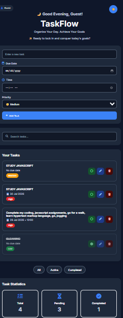

# ✅ TaskFlow — Your Productivity Companion

TaskFlow is a modern and responsive task management application designed to help users organize their daily activities, track progress, and stay productive.

Built with **HTML5, CSS3, and JavaScript (ES6)**, TaskFlow focuses on clean UI design, smooth user interaction, and efficient task management directly in the browser.

## 🚀 Live Demo

🔗 Coming soon

## 📌 Features

### Task Management

* ✅ Add new tasks
* ✏️ Edit existing tasks
* 🗑️ Delete tasks with confirmation
* ✔️ Mark tasks as completed
* 🔄 Automatically organize completed tasks

### Productivity Features

* 🔍 Search tasks quickly
* 🏷️ Filter tasks based on status
* 📅 Track task creation details
* 💾 Persistent storage using browser Local Storage

### User Experience

* 🌙 Dark mode support
* 📱 Responsive design for different screen sizes
* 🎨 Modern card-based interface
* ⚡ Fast and lightweight performance
* 🔔 User-friendly notifications and feedback messages

---

## 🛠️ Technologies Used

### Frontend

* HTML5
* CSS3
* JavaScript (ES6)

### Tools

* Git & GitHub
* Visual Studio Code
* Font Awesome Icons
* Google Fonts

---

## 📂 Project Structure

```
TaskFlow/
│
├── index.html        # Main application structure
├── style.css        # Styling and responsive design
├── script.js        # Application logic
│
├── images/
│   └── taskflow-preview.png
│
└── README.md
```

---

## ⚙️ Installation & Setup

To run TaskFlow locally:

1. Clone the repository:

```bash
git clone https://github.com/melody-boop/TaskFlow.git
```

2. Navigate into the project folder:

```bash
cd TaskFlow
```

3. Open `index.html` in your browser.

No additional installation or dependencies are required.

---

## 📸 Preview

```

```

---

## 💡 Development Journey

TaskFlow was built to strengthen my understanding of frontend development concepts including:

* DOM manipulation
* Event handling
* JavaScript application logic
* Browser Local Storage
* Responsive web design
* User interface development

The project helped transform fundamental JavaScript concepts into a practical, real-world application.

---

## 🔮 Future Improvements

Possible future enhancements include:

* User authentication
* Cloud database integration
* Task synchronization across devices
* Task categories and priority levels
* Notifications and reminders
* Progressive Web App (PWA) support

---

## 👩‍💻 Author

**Melody Mwayitsi**

Computer Science Student | Aspiring Software Engineer

* GitHub: [Melody-boop](https://github.com/Melody-boop)
* LinkedIn: ( https://linkedin.com/in/melody-mwayitsi-901100317 )

---

## 📄 License

This project is open-source and available for learning and personal development purposes.
